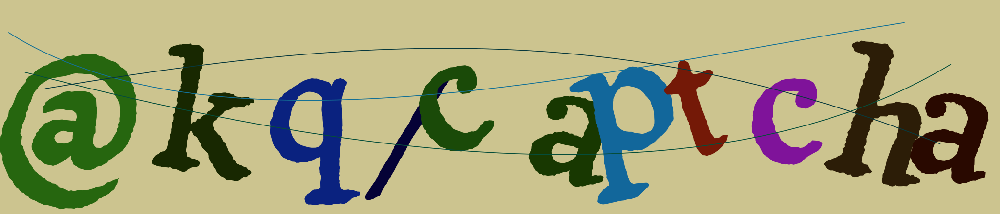

# @lovekeqing/captcha


一个简单的 SVG 验证码生成器，支持数字、字母、混合和数学公式类型，可自定义字体、字符集、干扰线等参数。

<div align="center">
  
</div>

## 特性

- 支持多种验证码类型：数字、字母、混合、公式
- 可自定义验证码长度、字符集、忽略字符
- 支持自定义字体（TTF）
- 可设置验证码图片宽高
- 支持设置背景颜色和自动计算字体颜色
- 干扰线数量和宽度可调
- 生成 SVG 格式验证码图片

## 安装

```sh
pnpm add @lovekeqing/captcha
```

## 使用方法

```ts
import { Captcha } from "@lovekeqing/captcha";

const captcha = new Captcha({
  type: "formula", // 验证码类型，可选："number" | "letter" | "mix" | "formula"
  length: 3, // 验证码长度或公式中数字个数
  noise: 2, // 干扰线数量
  fontPath: "./assets/Tagesschrift-Regular.ttf", // 字体路径
  backgroundColor: "#f2f4f8", // 背景色
});

captcha.generate().then(({ value, svg }) => {
  console.log("验证码值：", value);
  // svg 为验证码图片的 SVG 字符串
});
```

## 配置项

详见 [`CaptchaOptions`](src/types.ts)：

- `fontPath`：字体文件路径，支持 ttf
- `type`：验证码类型，"number" | "letter" | "mix" | "formula"
- `length`：验证码长度，默认 4，公式类型表示数字个数
- `width`/`height`：验证码图片宽高，默认自动计算
- `noise`：干扰线数量，默认 1
- `noiseWidth`：干扰线宽度
- `chars`：自定义字符集
- `ignoreChars`：忽略的字符集
- `backgroundColor`：背景颜色

## 命令

- `pnpm build`：构建项目
- `pnpm test`：运行测试
- `pnpm build:docs`：生成文档
- `pnpm build:all`：测试、构建并生成文档

## 许可证

MIT License
